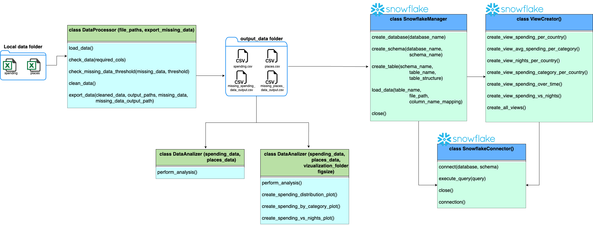
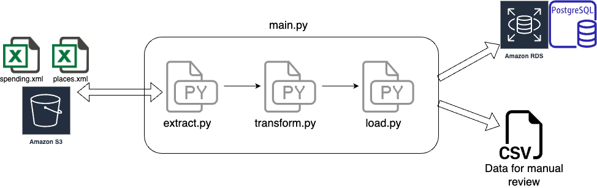

# Backpacking Trip Data Engineering Project

[logo](./documentation/img/backpacking_data_pipeline.png)

This project is a personal endeavor to improve my data engineering skills. The main goal is to ingest, process, and analyze data from my solo backpacking trip. During the trip, I tracked my spendings and places visited using two separate Excel files: `spending.xlsx` and `travels.xlsx`.

## Data Validation

Data validation is a key feature of this project. It ensures the integrity and correctness of the data before it is processed. Specific details about how data validation is implemented can be found in the documentation for each version of the project.

## Error Handling

Robust error handling is implemented to ensure that the project can handle unexpected situations gracefully. More details about how errors are handled can be found in the documentation for each version of the project.

## Data Structure

The data is structured in two Excel files as follows:

### Spending File

| Column          | Type     | Comment                                                     |
|-----------------|----------|-------------------------------------------------------------|
| Title           | VARCHAR  | Title of the spending                                       |
| Date            | DATE     | Date of the spending                                        |
| Amount          | DECIMAL  | Amount spent                                                |
| Currency        | VARCHAR  | Currency used for the spending                              |
| In_EUR          | DECIMAL  | Amount converted to EUR                                     |
| Category        | VARCHAR  | Category of the spending                                    |
| Payment_Method  | VARCHAR  | Payment method used                                         |
| City            | VARCHAR  | City where the spending occurred                            |
| Country         | VARCHAR  | Country where the spending occurred                         |
| Comment         | VARCHAR  | Additional comments                                         |

### Places File

| Column                    | Type     | Comment                                         |
|---------------------------|----------|-------------------------------------------------|
| Order                     | INTEGER  | Order of travel entry                           |
| Arrival_Date              | DATE     | Date of arrival                                 |
| Nights                    | INTEGER  | Number of nights stayed                         |
| Country                   | VARCHAR  | Country visited                                 |
| City                      | VARCHAR  | City visited                                    |
| Host_Name                 | VARCHAR  | Host name                                       |
| Couchsurfing_FLG          | VARCHAR  | Couchsurfing flag, indicating if it was a couchsurfing stay or not |
| G_FLG                     | VARCHAR  | G flag                                          |
| Bike_FLG                  | VARCHAR  | Bike flag, indicating if the host had a bike or not |
| Gender                    | VARCHAR  | Gender                                          |
| Hosts_Personality_Point   | INTEGER  | Host's personality point                        |
| Location_Point            | INTEGER  | Location point                                  |
| Comfort                   | VARCHAR  | Comfort                                         |
| Comment                   | VARCHAR  | Additional comments                             |

## Project Structure

The project is structured as follows:

```python
.
├── data
│   ├── raw_data
│   └── output_data
├── data_visualization
├── documentation
├── env
├── logs
├── plugins
├── src
│   ├── v1_DataProcessor
│   ├── v2_ETL
│   └── .env
├── tests
├── .gitignore
├── config.json
└── requirements.txt

```

### Data

This directory contains two subdirectories: `raw_data` and `output_data`. The `raw_data` directory contains the input Excel files (`spending.xlsx` and `travels.xlsx`). The `output_data` directory is used to store the cleaned CSV data and any missing data.

### Data Visualization

This directory is used to store plots in PNG format generated by the v1 version of the project.

## Documentation

This directory contains detailed documentation about the different versions of the project. The main `README.md` file points to the documentation in this directory.

### Env

This directory contains the virtual environment files.

### Plugins

This directory contains any plugins used in the project.

### Src

This directory contains the source code for the project. It is divided into two subdirectories: `v1_DataProcessor` and `v2_ETL`, each containing the source Python files for the respective version of the project. The `.env` file containing sensitive login information is also located in this directory.

### Tests

This directory contains the unit test files for the project, using `pytest`.

### Config.json

This is the configuration file for the project, containing various parameters. Here is the list of the parameters:

```json
{
    "spending_file_path_local": "data/raw_data/spending.xlsx",
    "places_file_path_local": "data/raw_data/travels.xlsx",
    "spending_file_path": "spending.xlsx",
    "places_file_path": "travels.xlsx",
    "cleaned_spending_output_path": "data/output_data/spending.csv",
    "cleaned_places_output_path": "data/output_data/places.csv",
    "data_visualization_folder_path": "data_visualization",
    "spending_required_cols": ["Title", "Date", "In EUR", "Category", "City", "Country"],
    "places_required_cols": ["Arrival_Date", "Nights", "Country", "City", "Host_Name", "Couchsurfing_FLG"],
    "missing_spending_output_path" : "data/output_data/missing_spending_data_output.csv",
    "missing_places_output_path" : "data/output_data/missing_places_data_output.csv",
    "missing_data_threshold" : 0.1,
    "s3bucket" : "backpackingtrip"
}
```

### Requirements.txt

This file lists the Python libraries required for the project. Here is a sample of its content:

```python
pandas
matplotlib
openpyxl
snowflake-connector-python[pandas]
python-dotenv
boto3
sqlalchemy 
psycopg2-binary
pytest
```

## Project Versions

The project has two versions: v1 and v2. Each version represents a different approach to data processing. Detailed documentation for each version can be found by clicking on the `images`.

### [Version 1 (v1_DataProcessor)](./documentation/v1_readme.md)

[](./documentation/v1_readme.md)

### [Version 2 (v2_ETL)](./documentation/v2_readme.md)

[](./documentation/v2_readme.md)

## Security

Sensitive login information is stored in a `.env` file located in the `src` directory. This file is not included in the version control system, as specified in the `.gitignore` file. Here is a sample of its content:

```python
SNOWFLAKE_USER=''
SNOWFLAKE_PASSWORD=''
SNOWFLAKE_ACCOUNT=''
SNOWFLAKE_REGION=''
SNOWFLAKE_ROLE=''
SNOWFLAKE_WAREHOUSE=''
AWS_ACCESS_KEY_ID=''
AWS_SECRET_ACCESS_KEY=''
POSTGRES_DB_LINK = ''
```

Please replace the empty strings with your actual credentials.

## Getting Started

To set up and run this project, you will need to:

1. Install Python.
2. Set up a virtual environment.
3. Install the dependencies listed in the `requirements.txt` file using the command `pip install -r requirements.txt`.

## Version Control

This project uses Git for version control. To contribute, you can clone the repository, create a new branch, make your changes, and then commit and push your changes to the repository.

## Future Improvements

In the future, I plan to add more complex and interactive data visualizations to help users better understand the data.

## Conclusion

This project is a great opportunity to practice and improve data engineering skills. It involves data ingestion, cleaning, processing, and visualization. The project is open to improvements and suggestions. Feel free to contribute!
